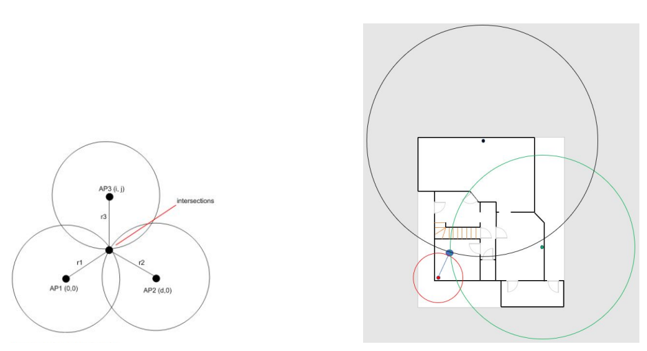

# WiFi triangulation tool

This tool provides tracking of location on a WiFi client in a building using 3 Access points.

Using the signal strength of each AP signal, simple triangulation is performed in combination with a Kalman filter  to smooth the signal. 

For this demo a default Voo wireless router and two Pycom's were used. 
The floorplan and mac addresses will need to be adjusted for each scenario. 

